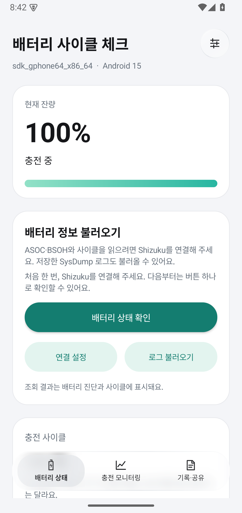
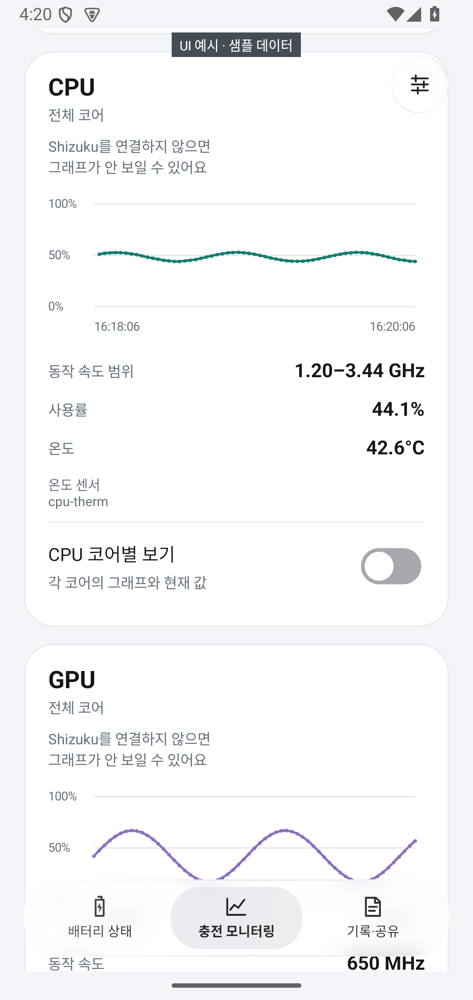
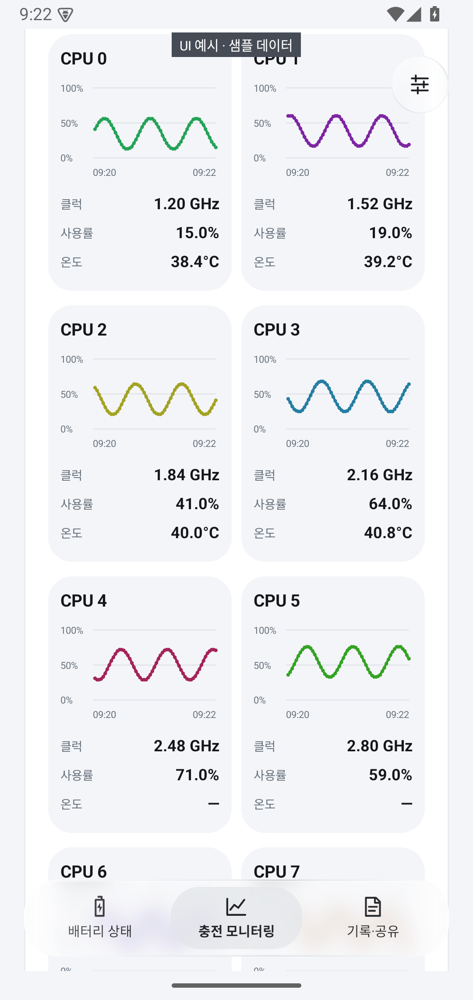
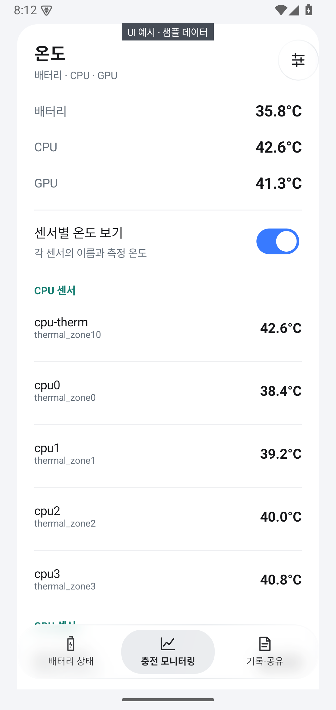
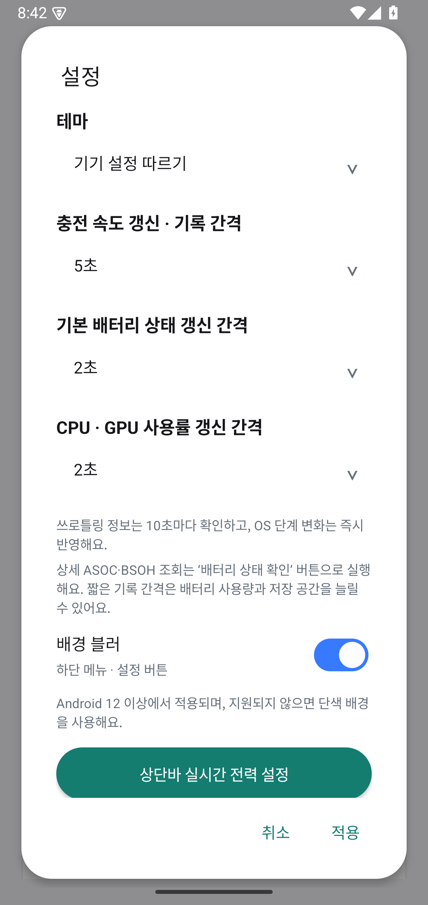
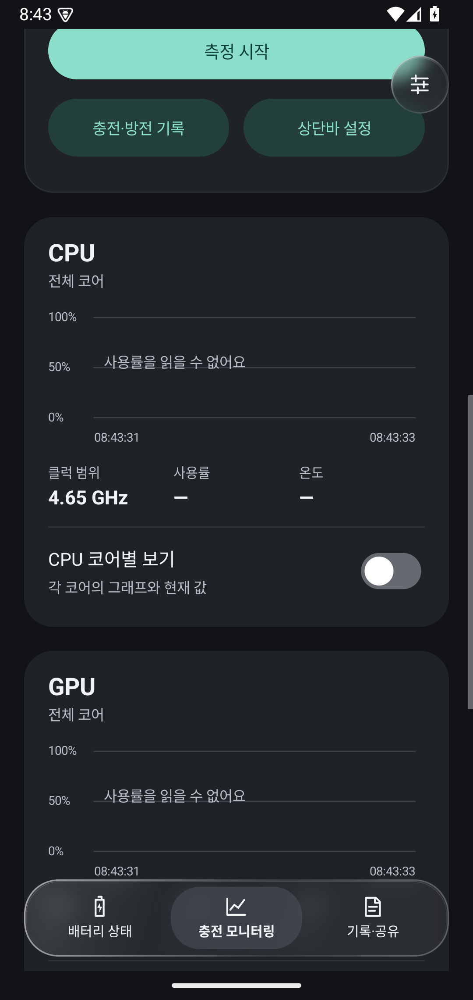
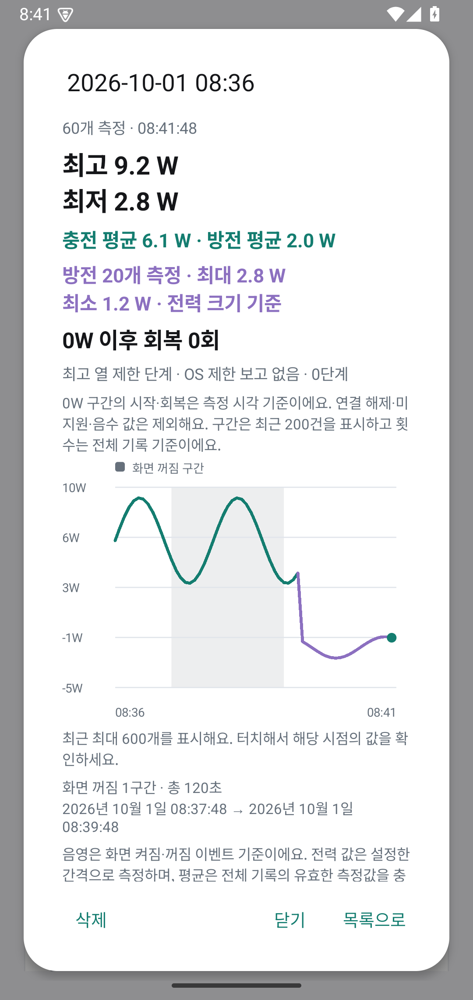

# 배터리 사이클 체크 · 갤럭시 배터리 수명 확인

**충전 전력과 배터리 진단 기록을 확인하는 Android 앱, 배터리 사이클 체크입니다.** 현재 전력(W), 실시간 그래프, 화면이 꺼진 동안의 기록을 제공하며, Shizuku 또는 SysDump 로그로 갤럭시의 내부 배터리 정보를 확인할 수 있습니다.

**[앱 다운로드 · v0.5.3](https://raw.githubusercontent.com/Lumi-01/galaxy-battery-health-check/main/dist/galaxy-battery-0.5.3.apk)** · **[Shizuku 설치·연결](docs/SHIZUKU_SETUP_KO.md)** · **[코드 수정·빌드](docs/DEVELOPMENT.md)**

> 수명·사이클을 버튼으로 조회하려면 **Shizuku 연결이 필요합니다.** 기종과 펌웨어에 따라 정보를 읽지 못할 수 있으며, 이때는 로그 파일 분석을 사용할 수 있습니다.

## 설치하고 시작하기

1. **휴대폰에서 [APK 다운로드](https://raw.githubusercontent.com/Lumi-01/galaxy-battery-health-check/main/dist/galaxy-battery-0.5.3.apk)**를 누릅니다.
2. 다운로드 알림 또는 **내 파일 → 다운로드**에서 APK를 열어 설치합니다. 설치 권한 안내가 나오면 파일을 연 앱의 설치 권한을 허용합니다.
3. **[Shizuku 연결 가이드](docs/SHIZUKU_SETUP_KO.md)**에 따라 Shizuku를 설치하고 시작합니다.
4. 앱에서 **배터리 상태 확인**을 누르고, 처음 나타나는 Shizuku 권한 요청을 허용합니다.

이후에는 **배터리 상태 확인** 버튼으로 다시 조회하면 됩니다. 휴대폰을 재부팅한 뒤에는 Shizuku를 다시 시작해야 할 수 있습니다.

이 저장소에서 받은 이전 APK는 앱을 삭제하지 않고 업데이트할 수 있습니다. 다운로드 파일의 체크섬은 [SHA256SUMS.txt](dist/SHA256SUMS.txt)에서 확인할 수 있습니다.

> v0.5.3에서 토글 표시를 수정하고, 쓰로틀링 확인 시각·화면 꺼짐 구간·충방전 평균 전력을 추가했습니다. [변경 안내](docs/UI_MONITORING_UPDATE.md)

## 앱 화면

Android 15 에뮬레이터에서 촬영했습니다. **‘UI 예시 · 샘플 데이터’가 있는 그래프·센서 화면은 화면 구성을 보여주는 예시이며, S25 실측값이 아닙니다.** 기본 화면·설정·다크 모드는 실제 에뮬레이터 화면입니다.

| 배터리 정보 | CPU·GPU 전체 그래프 | CPU 코어별 그래프 |
|---|---|---|
|  |  |  |

| 온도 센서 목록 | 설정 | 다크 모드 |
|---|---|---|
|  |  |  |

추가 화면: [충전 모니터링](docs/screenshots/charging-light.png) · [테마 선택 팝업](docs/screenshots/theme-menu-light.png) · [기록·공유 — 에뮬레이터 검증 기록](docs/screenshots/history-dark.png)

**충방전 평균과 화면 꺼짐 구간 예시** — 아래 전력 기록은 UI 검증용 샘플 데이터입니다. 청록색은 충전, 보라색은 방전이며, 회색 음영은 화면 꺼짐 구간입니다.

## 화면과 설정

하단의 둥근 메뉴로 세 화면을 전환합니다.

- **배터리 상태:** 현재 잔량, 배터리 정보 불러오기, 충전 사이클, 배터리 진단, 기본 상태.
- **충전 모니터링:** 현재 W, 최고·최저, 쓰로틀링 단계, 0W 회복 횟수, 그래프와 측정 시작·종료.
- **기록·공유:** 충전·진단 기록을 날짜별 카드로 열람하고 삭제하며, 측정 근거와 현재 결과를 공유.

각 화면 오른쪽 위 **설정**에서 **기기 설정 따르기 / 라이트 / 다크** 테마와 갱신 간격을 선택합니다. 충전 전력, 기본 배터리 상태, CPU·GPU 사용률의 간격을 각각 설정할 수 있습니다. 기본값은 순서대로 5초, 2초, 2초이며, 상세 진단은 조회 버튼으로 갱신합니다. 1초 기록은 전력 소비와 저장량을 늘릴 수 있습니다.

One UI를 참고한 회색 배경·흰 카드에 민트·청록색 버튼과 파란 스위치를 사용합니다. 보조 버튼은 연한 민트색, 다크 모드의 주요 버튼은 밝은 민트색으로 구분합니다. 잔량 막대는 둥근 민트 그라데이션이며, 잔량이 15% 이하일 때는 주황색으로 표시합니다. 선택한 하단 메뉴는 회색 캡슐로 구분하고, 메뉴·설정 버튼에는 반투명 블러와 빛 반사를 표현한 유리 테두리를 적용했습니다. 하단 메뉴는 64dp, 주요·보조 버튼은 48dp입니다. 배경 블러는 Android 12 이상에서 사용할 수 있고 설정에서 끌 수 있습니다. 앱 아이콘은 런처가 정한 모양을 따르며 Android 13의 테마 아이콘도 지원합니다.

Shizuku가 실행되지 않았거나 권한이 거부되거나 조회 중 연결이 끊기면 안내 창을 표시합니다. 연결됐지만 펌웨어가 배터리 필드를 제공하지 않는 경우는 별도 안내로 구분합니다.

## 확인할 수 있는 정보

| 항목 | 표시 내용 | 갱신 방식 |
|---|---|---|
| 충전 전력 | 배터리 전압 × 순전류로 계산한 W | 설정에서 1·2·5·10·30·60초 선택, 기본 5초 |
| 전력 그래프와 기록 | 전력 변화, 측정별 최고·최저 W, 날짜별 기록 | 측정 시작부터 종료까지, 화면이 꺼져도 저장 |
| CPU·GPU 사용률 그래프 | 기본은 전체 사용률, CPU 코어별 보기에서는 각 코어의 독립 그래프 | 모니터링 화면에서 1·2·5·10·30·60초 선택, 기본 2초, 최근 120개 |
| 그래프 하단 현재 값 | 클럭·사용률·온도, CPU 전체는 코어 클럭 범위 | 사용률과 함께 갱신, 미지원은 — 표시 |
| CPU·GPU 온도 | 전체 온도 센서 우선, 없으면 해당 센서 최고값과 센서 이름 | 사용률과 함께 조회, 코어별 수치는 펼쳐서 확인 |
| Live Update 상단바 칩 | 현재 전력만 `12.3W`처럼 표시 | Android 16 이상, 기기와 시스템 설정에 따라 표시 |
| 열 제한 단계 | Android가 보고하는 기기 전체의 0~6단계와 세션의 최고 단계 | 전력과 함께 조회·저장 |
| 0W 이후 회복 | 횟수와 0W 시작·양수 회복 시각 | 충전 기록 전체 기준, 구간은 최근 200건 표시 |
| 배터리 진단 카드 | 휴대폰에 저장된 ASOC 값 — 아래 해석 주의사항 참고 | 상세 조회 또는 로그 불러오기 |
| 충전 사이클 | 휴대폰이 제공한 사이클 또는 누적 사용량을 환산한 추정치 | 상세 조회 또는 로그 불러오기 |
| 현재 배터리 상태 | 잔량, 온도, 전압, 순간 전류, 남은 전하량, 상태 코드 | 화면 조회 간격 선택, 기본 2초 |
| 측정 근거 | 원본 배터리 필드, 출처, 읽은 시각, BSOH 등 | 조회 결과와 함께 표시 |

**설정한 시간은 앱의 조회 간격**이며, 센서 값 자체가 바뀌는 주기는 휴대폰이 결정합니다. 상세 진단 값은 버튼을 누르거나 새 로그를 불러올 때 갱신됩니다. 기본 화면 조회는 화면을 벗어나면 멈추지만, 사용자가 시작한 전력 측정은 별도 서비스에서 계속됩니다.

CPU·GPU 정보는 기기가 허용한 센서만 읽습니다. Shizuku 연결 후 읽을 수 있는 항목이 늘어날 수 있습니다. 읽지 못한 사용률은 그래프에서 빈 구간으로 표시하며, CPU·GPU 온도를 제공하지 않으면 확인 불가로 표시합니다. 이름만으로 CPU·GPU에 해당하는지 알 수 없는 SoC 센서는 원래 이름으로 상세 목록에 표시합니다.

**코어별 보기:** 기본은 CPU·GPU 전체 그래프이며, CPU 코어별 스위치를 켜면 각 코어의 그래프 아래에 클럭·사용률·온도를 표시합니다. 코어 온도를 제공하지 않으면 전체 온도만 표시하고, 같은 온도를 모든 코어에 복사하지 않습니다. 현재 GPU 조회 인터페이스는 전체 사용률과 클럭만 제공하므로 GPU 코어별 옵션에서는 지원 제한 안내를 표시합니다. ‘센서별 온도 보기’를 켜면 CPU·GPU·기타 센서를 이름별로 확인할 수 있습니다.

## 충전 전력 측정과 상단바 표시

1. **충전 모니터링 → 측정 시작**을 누르고, 첫 실행 시 앱 알림 권한을 허용합니다. 이 기능에는 Shizuku가 필요하지 않습니다.
2. 충전기를 연결하면 현재 W와 그래프가 갱신됩니다. 화면을 끄거나 다른 앱으로 이동해도 설정한 간격으로 기기에 저장합니다.
3. Android 16 이상에서는 **Live Update**로 현재 W만 상단바 칩에 표시하도록 요청합니다. **상단바 설정**에서 실시간 업데이트 허용 여부를 확인할 수 있습니다.
4. 앱 또는 연결된 Live Update의 **측정 종료**를 누르면 기록이 종료됩니다. **충전 기록**에서 이전 그래프와 최고·최저를 확인하고 개별·전체 삭제할 수 있습니다.

Live Update는 알림을 기반으로 하는 시스템 기능이므로 연결된 알림도 함께 존재합니다. 최고·최저 값은 앱에서만 표시합니다. **실제 칩 표시 여부는 One UI의 지원과 시스템 설정에 따라 달라지며**, 지원되지 않는 Android에서는 측정 서비스 알림이 표시됩니다. [Android Live Update 설명](https://developer.android.com/develop/ui/compose/notifications/live-update?hl=ko)

- **표시하는 W는 배터리 기준 순전력입니다.** 휴대폰 자체 소비와 변환 손실이 반영되므로 충전기·USB 포트의 출력이나 ‘45W 충전’ 협상 값을 직접 측정한 값과 다릅니다. Android가 제공하는 전류 부호에 따라 양수는 유입, 음수는 방전입니다. [BatteryManager](https://developer.android.com/reference/android/os/BatteryManager#BATTERY_PROPERTY_CURRENT_NOW)
- **최고·최저는 측정 전체의 유효한 충전 값으로 집계합니다.** 충전기 연결 상태와 충전 상태를 확인하며, 유효한 0W도 최저 값에 포함합니다. 미지원 값과 음수 방전 값은 충전 최고·최저에서 제외합니다.
- **평균 W는 전체 기록의 유효한 샘플을 충전·방전별로 나눠 계산한 산술평균입니다.** 충전 평균에는 유효한 0W도 포함하고, 방전 평균은 음수 전력의 크기를 표시합니다. 미지원 값은 제외합니다. 측정 간격을 바꾸면 샘플의 밀도가 달라지므로 시간 가중 평균이나 충전 에너지(Wh)와는 다릅니다.
- **화면 꺼짐 구간은 그래프에 회색 음영으로 표시합니다.** 측정 샘플과 별도로 화면 켜짐·꺼짐 이벤트 시각을 저장하므로 긴 측정 간격 사이의 짧은 화면 꺼짐도 기록합니다. 상세 기록에는 구간별 시작·종료 시각과 총 시간이 표시됩니다. 이전 기록에는 없던 화면 상태를 추정해 넣지 않으며, 앱 프로세스가 중단된 동안의 상태는 확인 불가로 구분합니다.
- **그래프는 최근 최대 600개 측정을 표시합니다.** 그래프를 터치하면 그 시점의 W·잔량·시각을 확인할 수 있습니다. 기록 전체를 저장하고, 최고·최저는 그래프의 표시 구간과 관계없이 전체 측정을 기준으로 계산합니다. 누락되거나 중단된 구간은 선으로 잇지 않습니다.
- **화면 꺼짐 측정은 CPU 깨우기 잠금을 사용합니다.** 측정 중에는 전력 소비가 늘 수 있습니다. 기록이 자주 중단되면 앱의 배터리 설정을 ‘제한 없음’으로 바꾸고 삼성 절전 앱 목록에서 제외해 주세요. 강제 종료·재부팅·시스템 종료 후에는 다시 시작해야 하며, 이전에 저장한 기록은 남습니다.

**방전 표시:** 충전 모니터링의 **상단바 설정**에서 ‘방전 중에도 상단바에 전력 표시’를 켜면 음수 W도 표시하도록 요청합니다. 기본값은 꺼짐이며, 최고·최저는 상단바에 표시하지 않습니다.

**갤럭시 설정:** 개발자 설정 → 추가 설정 → **모든 앱의 실시간 정보 보기**를 활성화해 주세요. 메뉴 위치와 이름은 One UI 버전에 따라 다를 수 있습니다. 앱의 실시간 업데이트 허용 여부도 상단바 설정에서 확인할 수 있습니다.

**0W 기록:** 양수 충전 전력이 측정된 뒤, 연결이 유지된 상태에서 정확히 0W가 한 번 이상 측정되고 다시 양수로 회복하면 한 건으로 셉니다. 연속된 0W는 한 구간이며, 회복하지 않은 구간은 아직 횟수에 포함하지 않습니다. 연결 해제·전원 종류 변경·미지원·음수·3분 초과 측정 공백이 있으면 구간을 끊습니다. 잠시 충전이 정지돼 Android가 `NOT_CHARGING`으로 보고한 유효한 0W도 연결이 유지되면 포함합니다. 시각은 샘플을 읽은 시각이므로 실제 전환 시각과 설정한 간격만큼 차이가 날 수 있습니다. 0W라는 사실만으로 충전기 문제를 판정하지 않습니다.

**쓰로틀링:** OS가 보고한 0~6단계를 상태 변경 이벤트로 즉시 갱신합니다. 0은 **OS가 제한을 보고하지 않았다는 뜻**이며 실제 쓰로틀링이 없다는 보장은 아닙니다. 1~3은 가벼움·보통·심함, 4~6은 위험·긴급·종료 필요입니다. 열 부하를 10초마다 별도로 확인하고, 접근 가능한 CPU·GPU·주파수 제한 장치의 작동 상태도 함께 표시합니다. 열 부하 1.0은 심한 제한 기준이며, 그 이상을 임의의 OS 단계로 환산하지 않습니다. 클럭 하락이나 높은 온도만으로 제한을 확정하지 않습니다. 기록의 최고 단계는 OS가 보고한 값을 기준으로 유지합니다. [Android Thermal API와 기기 제한](https://developer.android.com/games/optimize/adpf/thermal?hl=ko)

## 이전 기록 보기와 삭제

상세 조회 또는 로그 분석에서 배터리 항목을 찾으면 **조회 당시의 결과가 자동 저장**됩니다. 앱을 종료하거나 휴대폰을 재부팅해도 기록이 유지됩니다.

- **기록·공유 → 진단 기록:** 최근 기록부터 날짜·출처·ASOC·BSOH·추정 사이클을 확인하고, 항목을 눌러 당시의 측정 근거를 읽습니다.
- **충전 기록:** 날짜별 카드에서 최고·최저, 0W 회복 횟수, 최고 열 제한 단계를 확인하고, **그래프 · 구간 보기**로 측정별 값과 0W 시작·회복 시각을 엽니다.
- **기록 하나 삭제:** 기록을 열고 **삭제**를 누른 뒤 확인합니다.
- **전체 삭제:** 기록 목록에서 **전체 삭제**를 누른 뒤 확인합니다.

기본 정보의 주기적 갱신은 자동 저장하지 않습니다. 원본 덤프 대신 배터리 결과만 앱 내부에 보관하며, 기록을 삭제해도 사용자가 불러온 원본 파일은 남습니다. 로그 분석 기록의 날짜는 **불러온 시각**으로, 로그 생성 시각과 다를 수 있습니다. 앱 데이터 삭제 또는 앱 제거 시 저장 기록도 지워집니다.

## Shizuku로 값이 나오지 않는다면

앱의 **로그 불러오기**로 SysDump 파일을 분석할 수 있습니다. 이 방식은 Shizuku 연결 없이 사용할 수 있습니다.

1. 삼성 전화 앱에서 `*#9900#`을 입력합니다.
2. **Run dumpstate/logcat**을 실행하고 완료될 때까지 기다립니다.
3. **Copy to sdcard** 또는 해당 복사 메뉴를 실행합니다.
4. 이 앱의 **로그 불러오기 → 파일 선택**에서 내부 저장소 `log` 폴더의 최신 `dumpstate` 파일을 선택합니다.

파일이 보이지 않으면 삼성 **내 파일**에서 `Download` 폴더로 복사한 뒤 선택하세요. SysDump 메뉴의 제공 여부, 이름과 저장 위치는 펌웨어에 따라 다릅니다.

**덤프 생성은 직접 진행하고, 배터리 항목 검색과 계산은 앱이 처리합니다.** TXT·LOG·ZIP·GZIP을 지원합니다. ZIP에 서로 다른 시점의 값이 섞여 있으면 하나를 임의로 선택하지 않으므로, 압축을 풀어 최신 로그 한 개를 선택하는 편이 좋습니다.

## ASOC와 BSOH는 어떻게 다른가요?

[삼성 Members 운영진의 설명](https://r1.community.samsung.com/t5/galaxy-s/phone-battery-health/td-p/37000087)에 따르면 **ASOC는 충전량 보정과 관련된 값**, **BSOH는 원래 설계 용량 대비 배터리 건강 상태를 나타내는 값**이며, 배터리 건강 상태를 판단할 때는 BSOH가 더 적합합니다. 이는 지원 포럼의 설명이며, 기종·펌웨어별 내부 계산식까지 공개한 기술 명세는 아닙니다.

**현재 v0.5.3는 ‘배터리 진단’ 카드에 ASOC를 표시하고, BSOH는 ‘측정 근거’에 별도로 표시합니다.** 카드의 ASOC를 그대로 ‘남은 수명 %’ 또는 정확한 용량 유지율로 해석하지 마세요. 두 값은 서로 대체하거나 평균 내지 않습니다. 상태 표시줄의 현재 배터리 잔량과도 구분해야 합니다.

## 수치를 해석할 때

- **진단 값은 앱이 직접 실측한 용량이나 남은 사용 연수가 아닙니다.** 실제 사용 시간과 일치한다고 보장할 수 없습니다.
- **추정 사이클은 `mSavedBatteryUsage ÷ 100`으로 계산합니다.** 삼성의 공개 API로 보장된 공식 환산 규칙은 아니며, 충전기를 연결한 횟수와도 다릅니다.
- **‘정상’이라는 상태는 성능 100%를 뜻하지 않습니다.** 남은 전하량 역시 완충 용량과 다릅니다.
- **로그는 생성 당시의 기록입니다.** 화면에 표시되는 읽은 시각을 로그 생성 시각으로 해석하면 안 됩니다.

앱은 누락·미지원·범위 밖 값이나 서로 충돌하는 값을 확정 수치로 표시하지 않습니다. 사이클 값이 0인 경우에도 실제 0회인지 미지원 값인지 구분할 수 없어 확정하지 않습니다. ASOC와 BSOH는 서로 섞지 않고, BSOH는 **측정 근거**에서 별도로 보여줍니다.

## 지원 환경과 확인 범위

- **앱 최소 실행 환경:** Android 8.0 이상
- **PC 없이 Shizuku를 연결하는 무선 디버깅 방식:** Android 11 이상
- **개발 기준 기기:** Galaxy S25 · One UI 9.0 베타
- **검증:** 값 처리·로그 분석·전력 계산·기록 저장 및 삭제·하드웨어 정보 186개 검증과 APK 빌드·서명 검증 통과. 에뮬레이터에서 토글 그림의 실제 ON/OFF 색상, OS 열 단계 변화, 60초 측정 사이의 짧은 화면 꺼짐 저장도 확인했습니다.

모든 갤럭시에서 상세 정보를 읽을 수 있다고 보장하지 않습니다. **S25 베타에서 Shizuku를 통한 상세 값 조회 성공 여부는 아직 실기기 확인이 필요합니다.** Shizuku 연결 성공과 배터리 필드 제공 여부는 별개입니다.

## 개인정보와 문제 제보

배터리 정보와 선택한 로그는 **기기 안에서 처리**합니다. 앱에는 인터넷 권한, 광고·분석 SDK, 자동 업로드 기능이 없습니다.

**측정 근거 · 결과 공유**를 누르면 배터리 필드, 모델명, OS 빌드, 조회 시각과 연결 진단을 복사하거나 공유할 수 있습니다. 전체 덤프 파일과 무관한 로그 내용은 공유 결과에 포함하지 않습니다.

문제가 있으면 [Issues](https://github.com/Lumi-01/galaxy-battery-health-check/issues)에 증상과 앱 버전을 남겨 주세요. 값 조회 문제는 앱에서 복사한 측정 근거를 함께 제공하면 확인에 도움이 됩니다. 전체 덤프 파일은 필요하지 않습니다.

## 코드 수정과 빌드

앱의 화면과 기능은 Kotlin으로 작성되어 있습니다. **[개발 가이드](docs/DEVELOPMENT.md)**에서 코드 위치, Android Studio·VS Code 사용법, 빌드 방법을 확인할 수 있습니다.

화면 제목·문구·버튼을 수정하려면 [MainActivity.kt](app/src/main/java/kr/local/galaxybattery/MainActivity.kt)부터 보면 됩니다.

## 참고 자료

- [Shizuku 공식 사이트](https://shizuku.rikka.app/) · [Shizuku API](https://github.com/RikkaApps/Shizuku-API)
- [Android BatteryManager](https://developer.android.com/reference/android/os/BatteryManager)
- [MyBattery의 삼성 로그 필드 설명](https://github.com/Alyaqdhans/MyBattery)
- [SysDump 방법을 소개한 커뮤니티 글](https://www.reddit.com/r/samsunggalaxy/comments/1qvv3y1/guide_how_to_check_your_true_samsung_battery/)
- [외부 라이브러리 및 라이선스](THIRD_PARTY.md)

커뮤니티 자료의 충전 보정 방법이나 배터리 교체 기준은 앱의 판단 근거로 사용하지 않습니다.
