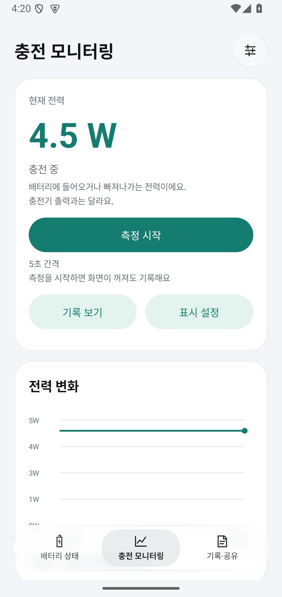
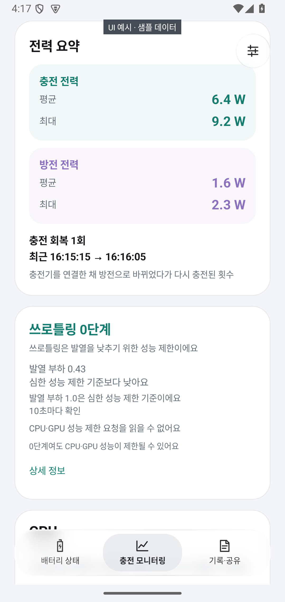
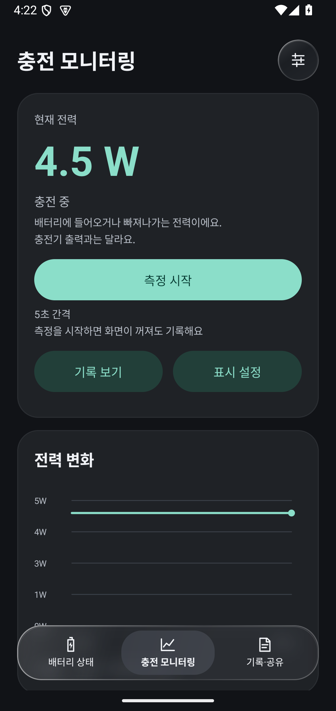

# 배터리 사이클 체크

갤럭시의 배터리 진단·사이클과 충전·방전 전력을 확인하는 Kotlin Android 앱입니다. 전력 그래프와 진단 결과를 기기에 저장하고 이전 기록을 다시 볼 수 있습니다.

**[APK 다운로드 · v0.5.6](https://raw.githubusercontent.com/Lumi-01/galaxy-battery-health-check/main/dist/galaxy-battery-0.5.6.apk)** · **[Shizuku 설치·설정](docs/SHIZUKU_SETUP_KO.md)** · **[코드 수정·빌드](docs/DEVELOPMENT.md)**

휴대폰에서 다운로드 링크를 누르고 **내 파일 → 다운로드**에서 APK를 열어 설치하세요. 이전 버전 위에 업데이트할 수 있습니다. [SHA256 체크섬](dist/SHA256SUMS.txt)

## 앱 화면

Android 15 에뮬레이터 화면입니다. **‘UI 예시 · 샘플 데이터’가 표시된 화면과 기록 상세 예시는 화면 검증용 데이터이며 S25 실측값이 아닙니다.**

| 배터리 상태 | 충전 모니터링 | 설정 |
|---|---|---|
|  |  |  |

| 전력 요약 예시 | CPU 코어별 예시 | 다크 모드 |
|---|---|---|
|  |  |  |

추가 화면: [전체 CPU·GPU](docs/screenshots/hardware-example-light.png) · [온도 센서](docs/screenshots/sensors-example-light.png) · [갱신 간격](docs/screenshots/settings-intervals-light.png) · [화면 꺼짐 음영 예시](docs/screenshots/power-preview-example-light.png) · [기록 상세 예시](docs/screenshots/power-history-example-light.png)

## 세 개의 메뉴

- **배터리 상태:** 현재 잔량, 상세 정보 조회, 충전 사이클·배터리 진단, 기본 상태.
- **충전 모니터링:** 현재 전력 → 그래프 → 충전·방전 요약 → 쓰로틀링 → CPU·GPU·온도 순서로 표시합니다. 각 항목을 별도 카드로 나누고 상세 정보는 펼쳐서 확인합니다.
- **기록·공유:** 충전·방전 기록과 진단 기록을 날짜별로 보고 삭제합니다. 측정 근거와 현재 진단 결과를 공유할 수 있습니다.

민트색은 충전, 보라색은 방전입니다. 통계는 충전·방전 각각 **평균·최대**만 표시하며, 측정 개수와 최소값은 요약에서 제외했습니다. 카드·하단 메뉴의 폭과 버튼 높이를 통일하고 One UI를 참고한 색상과 둥근 모서리를 사용합니다.

## 설정

오른쪽 위 **설정**에서 다음을 조정합니다.

- **실시간 정보 표시:** 충전 전력과 방전 전력을 각각 켜고 끕니다. 기본값은 충전 켜짐·방전 꺼짐입니다. 측정 중에만 동작하며 표시 옵션을 바꿔도 기록은 계속됩니다.
- **화면:** 기기 설정 따르기 / 라이트 / 다크, 메뉴·설정 버튼의 배경 블러. 블러는 Android 12 이상에서 지원합니다.
- **갱신 간격:** 전력, 배터리 상태, CPU·GPU를 각각 1·2·5·10·30·60초로 설정합니다. 기본값은 5·2·2초입니다. 쓰로틀링 추가 조회는 10초 간격, OS 단계 변화는 즉시 반영합니다.

**적용**을 눌러 저장합니다. 짧은 조회 간격과 화면 꺼짐 기록은 전력 소비·저장량을 늘릴 수 있습니다. 설정한 시간은 앱 조회 간격이며 센서의 실제 갱신 주기는 기기가 결정합니다.

## 전력 측정과 상단바 표시

**충전 모니터링 → 측정 시작**을 누르고 알림 권한을 허용하세요. 화면을 끄거나 다른 앱으로 이동해도 기록합니다. **측정 종료** 후 **기록·공유 → 충전·방전 기록 → 상세 보기**에서 그래프와 구간을 확인할 수 있습니다. Shizuku 없이 사용할 수 있습니다.

Android 16 이상에서는 Live Update로 현재 W만 상단바에 표시하도록 요청합니다. 갤럭시는 **개발자 설정 → 추가 설정 → 모든 앱의 실시간 정보 보기**를 켜야 정상 표시됩니다. 앱 설정의 **시스템 표시 설정**에서도 허용 여부를 확인하세요. 기기·펌웨어에 따라 메뉴 이름과 칩 표시 지원이 다를 수 있습니다. Live Update는 알림 기반 기능이며 기록 서비스 알림도 존재합니다. 해당 방향의 표시를 끄면 W 칩을 요청하지 않고 기록만 계속합니다. [Android Live Update](https://developer.android.com/develop/ui/views/notifications/live-update)

- **W는 배터리 전압 × 순전류입니다.** 충전기의 출력이나 45W 협상 값을 측정한 값과 다릅니다. 그래프의 양수는 유입, 음수는 방전입니다. 통계의 방전 값은 크기로 표시합니다. [BatteryManager 전류 정의](https://developer.android.com/reference/android/os/BatteryManager#BATTERY_PROPERTY_CURRENT_NOW)
- **평균은 유효한 샘플의 산술평균입니다.** 충전에는 유효한 0W를 포함하고, 미지원 값은 제외합니다. 시간 가중 평균이나 충전 에너지(Wh)는 아닙니다. 평균·최대는 그래프의 최근 표시 범위와 관계없이 기록 전체를 기준으로 계산합니다.
- **회색 음영은 화면이 꺼진 구간입니다.** 전력 샘플과 별도로 화면 이벤트를 저장합니다. 측정 시작 전 미리보기에서도 음영을 표시하며 미측정 구간을 선으로 잇지 않습니다. 과거 기록·프로세스 중단 구간에 없던 화면 상태를 추정하지 않습니다. 그래프는 최근 최대 600개 측정값을 표시하고 터치해 값을 확인할 수 있습니다.
- **충전 회복은 연결을 유지한 채 양수 충전 → 음수 방전 → 양수 충전으로 바뀐 경우입니다.** 0W만 찍거나 충전기를 뺐다 꽂은 경우는 세지 않습니다. 방전 시작·회복 시각과 구간 최저 전력을 저장하며 구간 목록은 최근 200건까지 표시합니다. 미지원 값, 전원 종류 변경, 3분 초과 조회 공백은 연속 구간을 끊습니다. 시각은 샘플 관측 시각이며 이것만으로 충전기 이상을 판정하지 않습니다. 이전 기록도 저장된 원시 샘플로 새 규칙을 적용합니다.

측정은 CPU 깨우기 잠금을 사용합니다. 기록이 중단되면 앱 배터리 설정과 삼성 절전 앱 목록을 확인하세요. 강제 종료·재부팅 후에는 측정을 다시 시작해야 합니다.

## 쓰로틀링과 CPU·GPU

쓰로틀링은 **OS가 보고한 0~6단계**로 표시합니다. 발열 부하와 심한 쓰로틀링 기준 **1.0**을 함께 표시하고, 조회 가능한 커널 제한 장치의 신호는 별도로 보여줍니다. CPU·GPU 성능 제한 요청은 기기가 성능을 낮추도록 요청한 항목입니다. 개수는 코어 수나 OS 단계가 아닙니다. 읽은 항목에 요청이 없는 경우와 값을 읽지 못한 경우를 구분합니다. 확인 시각·읽은 방법·제한 요청 수준은 **상세 정보**에서 확인합니다.

**0단계는 실제 쓰로틀링이 없다는 보장이 아닙니다.** 부하·커널 신호를 임의의 OS 단계로 환산하거나 온도·클럭 하락만으로 쓰로틀링을 확정하지 않습니다. 기록의 최대 단계는 OS 보고값 기준입니다. [Android Thermal API](https://developer.android.com/games/optimize/adpf/thermal?hl=ko)

CPU·GPU는 기본적으로 전체 사용률 그래프와 동작 속도(클럭)·사용률·온도를 표시합니다. **CPU 코어별 보기**를 켜면 한 줄에 두 코어씩 표시합니다. 코어 온도가 없으면 전체 온도만 표시하며 값을 복사하지 않습니다. 현재 GPU 조회 방식은 전체 정보만 지원합니다. **센서별 온도 보기**에서는 이름별 값을 확인합니다. 미지원 값은 **—**이며 누락 구간은 선으로 잇지 않습니다. Shizuku를 연결하지 않으면 CPU·GPU 그래프가 표시되지 않을 수 있습니다. 연결해도 기기에서 정보를 제공하지 않으면 표시할 수 없습니다.

## 배터리 진단과 사이클

상세 값을 버튼으로 조회하려면 **[Shizuku 연결](docs/SHIZUKU_SETUP_KO.md)**이 필요합니다. Shizuku를 시작한 뒤 앱의 **배터리 상태 확인**을 눌러 권한을 허용하세요. 연결 실패와 기기에서 필드를 제공하지 않는 경우는 구분해 안내합니다.

지원되지 않으면 삼성 전화 앱의 `*#9900#` → **Run dumpstate/logcat** → **Copy to sdcard**로 로그를 만들고 앱의 **로그 불러오기**로 선택합니다. TXT·LOG·ZIP·GZIP을 지원합니다. 파일이 보이지 않으면 `log` 폴더의 최신 덤프를 `Download`로 복사하세요. SysDump 제공 여부·이름·저장 위치는 펌웨어마다 다릅니다. 여러 시점의 덤프가 섞인 ZIP보다는 최신 로그 하나를 선택하세요.

**ASOC는 충전량 보정 관련 값, BSOH는 설계 용량 대비 건강 상태 관련 값**이라는 [삼성 Members 운영진 설명](https://r1.community.samsung.com/t5/galaxy-s/phone-battery-health/td-p/37000087)이 있습니다. 내부 계산식 전체를 공개한 기술 명세는 아닙니다. ASOC를 정확한 남은 수명 %로 해석하거나 BSOH와 섞지 않습니다. 앱은 진단에 ASOC를, 측정 근거에 BSOH를 별도로 표시합니다. Android가 제공한 SOH는 **배터리 성능**으로 구분합니다.

누적 사용량 기반 추정 사이클은 `mSavedBatteryUsage ÷ 100`입니다. 공개 API가 보장하는 공식 환산 규칙이나 충전기 연결 횟수와는 다릅니다. 기본 배터리의 ‘정상’ 상태는 성능 100%를 뜻하지 않습니다. 누락·충돌·미지원 값을 확정 수치로 표시하지 않으며 사이클 0도 미지원과 구분할 수 없으면 확정하지 않습니다.

## 기록·삭제·개인정보

상세 조회·로그 분석에서 배터리 항목을 찾으면 결과가 자동 저장됩니다. 기본 상태의 주기적 갱신은 저장하지 않습니다. 진단 기록의 날짜는 조회·불러오기 시각이며 덤프 생성 시각과 다를 수 있습니다.

기록 목록에서 개별 또는 전체 삭제할 수 있습니다. 기록 삭제는 불러온 원본 파일을 지우지 않습니다. 앱 데이터 삭제·앱 제거 시 내부 기록도 삭제됩니다.

정보와 로그는 기기 안에서 처리합니다. 인터넷 권한·광고·분석 SDK·자동 업로드는 없습니다. 결과 공유에는 배터리 필드·기기 정보·조회 시각·연결 진단만 포함하며 전체 덤프는 포함하지 않습니다.

## 지원과 검증

Android 8 이상, 무선 디버깅 Shizuku 설정은 Android 11 이상에서 사용할 수 있습니다. 개발 기준은 Galaxy S25·One UI 9.0 베타입니다. **S25 베타의 실제 상세 값 조회와 Android 16 상단바 칩은 실기기 확인이 필요합니다.** 기종·펌웨어마다 필드 제공 여부가 다릅니다.

v0.5.6은 순수 로직 203개 검사, 에뮬레이터의 토글·설정 적용·레이아웃·쓰로틀링 표시·화면 이벤트 검사, Kotlin/Gradle 빌드와 APK 서명 검증을 통과했습니다. [변경·검증 상세](docs/UI_MONITORING_UPDATE.md) · [기기 검사 코드](tests/device)

기능·UI 코드는 [app/src/main/java/kr/local/galaxybattery](app/src/main/java/kr/local/galaxybattery)에 있습니다. [개발 가이드](docs/DEVELOPMENT.md) · [외부 라이선스](THIRD_PARTY.md) · [Issues](https://github.com/Lumi-01/galaxy-battery-health-check/issues)
